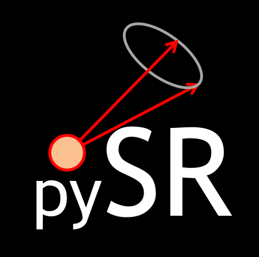

# pySERESCAL

## About
pySERESCAL is a Python translation of the Matlab toolbox "SERESCAL" (version 2014), written by K. Habicht (Helmholtz Zentrum Berlin, Germany). It allows calculating the three axis-neutron resonant spin echo (TAS-NRSE) resolution function, to correct raw data from instrumental and sample specific effects.

## References
+ K. Habicht *et al.*, *The resolution function in neutron spin-echo spectroscopy with three-axis spectrometers*,  [J. Appl. Cryst. **36**, 1307-1318 (2003)](https://doi.org//10.1107/S0021889803015681)
+ F. Groitl *et al.*, *Generalized resolution matrix for neutron spin-echo three-axis spectrometers*, [J. Appl. Cryst. **51**, 818-830 (2018)](https://doi.org//10.1107/S1600576718005307)

## Authors
+ N. Martin, Université Paris-Saclay, CNRS, CEA, Laboratoire Léon Brillouin, Gif-sur-Yvette, France, <nicolas.martin@cea.fr>
+ F. Bourdarot, Université Grenoble Alpes, CEA, IRIG-MEM-MDN, Grenoble, France, <bourdaro@ill.fr>
